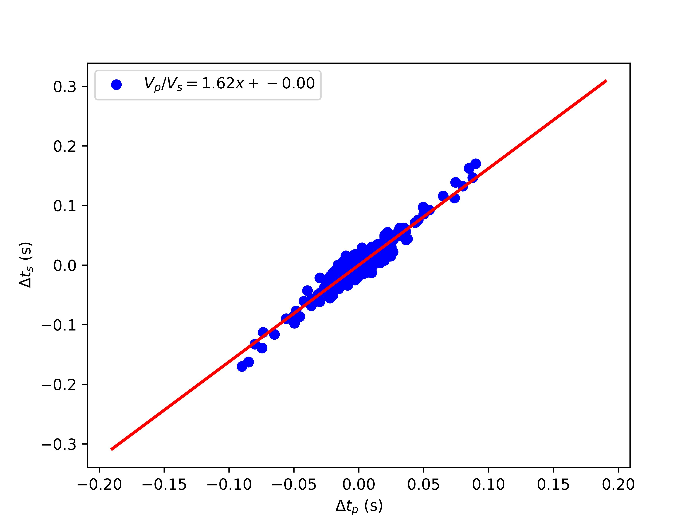

A Python code to calculate the Vp/Vs ratio using pairs of P and S differential travel times from a tight cluster of events. The differential times can be provided from FDTCC (cross correlation-based differential times) or hypoDD (catalog-based differential times) programs. Several regression approaches are implemented to best fit a line to the distribution and get the Vp/Vs ratio (slope of the fitted line): 
1. IRLS (Iteratively Reweighted Least Squares)
2. OLS (Ordinary Least Square)  
3. HUBER (Huber regression)
4. RANSAC (RANdom SAmple Consensus)

The FDTCC program can be found here:  https://github.com/MinLiu19/FDTCC  
The hypoDD program can be found here: https://github.com/fwaldhauser/HypoDD

**Input Format**  
InsVpVs works based on the dt.cc file derived from FDTCC (recommended) and the dt.ct file derived from hypoDD:  
```
dt.cc format:
# event_ID1     event_ID2    0
station     differential_time       CC    phase

dt.ct format:
# event_ID1     event_ID2
station   tt_1    tt_2    1.00    phase
```

If dt.ct file is used, differential times are calculated as ```tt_1 - tt_2```.
<div id="header" align="center">
  
</div>
